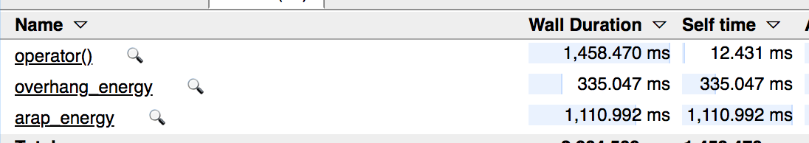
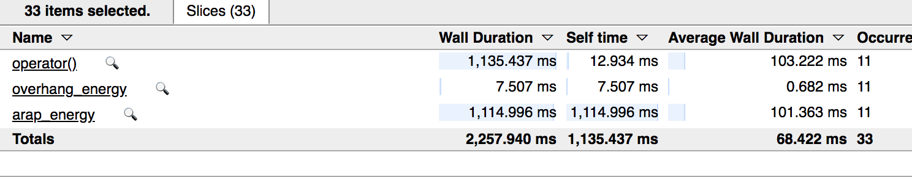

###  Check `abstract.pdf`


```
# http://www.citethisforme.com/
#   1. set format to biblatex
#   2. copy -> paste to `references.bib`
#   3. open vim and type `:%s/\[break\]\s/\r/g`
```


#### resources


+ a nice tutorial on [framebuffer internals](http://www.songho.ca/opengl/gl_fbo.html)
+ a nice tutorial on [rendering depth to texture](https://paroj.github.io/gltut/Positioning/Tut05%20Overlap%20and%20Depth%20Buffering.html)
+ user-defined clipping via [`gl_ClipDistance`](https://www.khronos.org/opengl/wiki/Vertex_Post-Processing)
    + clip points beyond a plane
+ webpage with some simple [objs](https://people.sc.fsu.edu/~jburkardt/data/obj/cube.obj)


#### self-intersection method


+ prepare
    + 2 framebuffer with depth buffer attached as textures for current and previous rendering passes
    + 1 framebuffer with depth buffer attached as renderbuffer to keep track of accumulated self-intersection distance / fragment (use `gl_FragDepth` in fragshader)
+ `peel_shader`
    + depth peeling by `discard`-ing fragments that is less than or equal to max depth (stored in texture from previous pass rendered depth buffer) while enabling depth test
    + use `gl_FrontFacing` to determine inside/outside
+ 


#### Profiling

##### 2d

```
build/support_reduction woody-cross 10 1 20 0.0001 1 1
```


+ first iteration



+ optimized overhang energy


### presentation 

+ overhang energy not printer specific but can be twisted to an advantage, in that we can use it to account for 
    + physics based material strength to support itself
    + make it balance i.e. center of mass